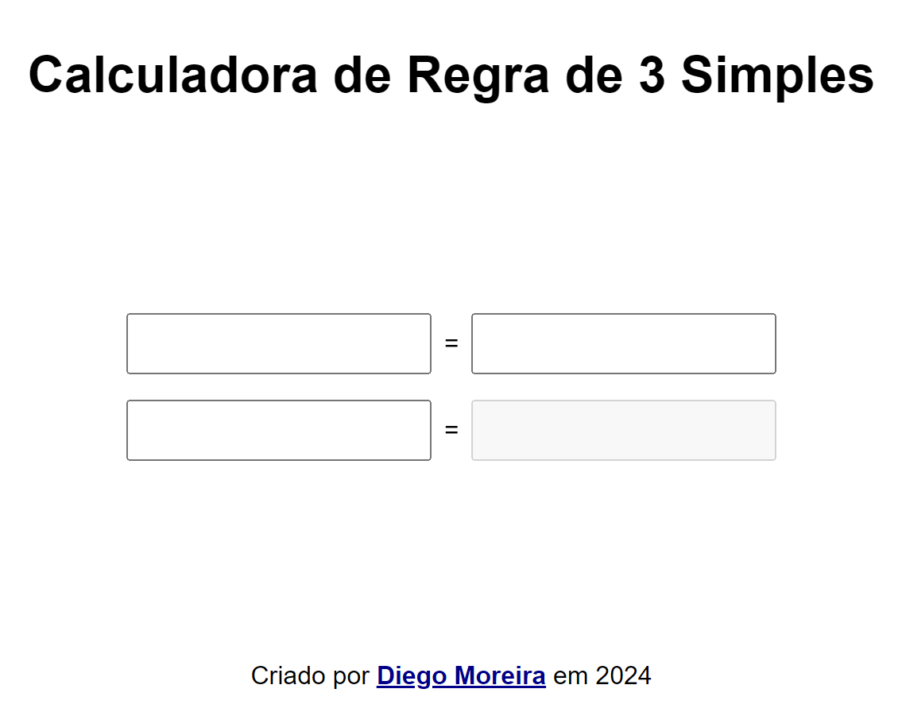

# Calculadora de Regra de Três Simples

Este é um projeto pessoal de uma calculadora de regra de três simples. Você pode usá-lo baixando o arquivo `index.html` e abrir no navegador, ou acessando o site: [diego-moreira8.github.io/regra-de-tres](https://diego-moreira8.github.io/regra-de-tres/).

